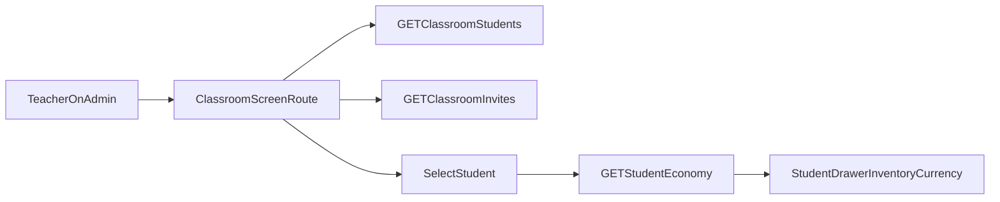

# Admin Classroom Detail Screen

## Outcome

Build a classroom screen in `@odyssey/admin` that lets teachers:

- view all students in a class,
- view invites with `Pending/Accepted/Expired` status,
- open a student drawer to inspect inventory and currency.

Use Chakra UI for the new screen and wire data from new server/shared contracts.

Reference: [Chakra UI repository](https://github.com/chakra-ui/chakra-ui).

## Backend + Shared Contracts

- Add new shared types and Zod validators for admin classroom detail payloads:
  - invite list item with status derivation inputs (`acceptedAt`, `expiresAt`)
  - classroom student summary (id, email, displayName, membershipCreatedAt)
  - student economy snapshot (inventory + currency)
- Files:
  - [packages/shared/src/types/classroom.ts](/Users/zach/src/github.com/zspencer/archive_raiders/packages/shared/src/types/classroom.ts)
  - [packages/shared/src/types/invite.ts](/Users/zach/src/github.com/zspencer/archive_raiders/packages/shared/src/types/invite.ts)
  - [packages/shared/src/validators/classroom.schema.ts](/Users/zach/src/github.com/zspencer/archive_raiders/packages/shared/src/validators/classroom.schema.ts)
  - [packages/shared/src/validators/invite.schema.ts](/Users/zach/src/github.com/zspencer/archive_raiders/packages/shared/src/validators/invite.schema.ts)
  - [packages/shared/src/index.ts](/Users/zach/src/github.com/zspencer/archive_raiders/packages/shared/src/index.ts)
- Extend server services with read methods:
  - `ClassroomService`: list students for a teacher-owned classroom
  - `InviteService`: list invites for a teacher-owned classroom (include `acceptedAt` and `expiresAt`)
- Add teacher-only API routes:
  - `GET /classrooms/:classroomId/students`
  - `GET /classrooms/:classroomId/invites`
  - `GET /classrooms/:classroomId/students/:studentId/economy` (inventory + currency, classroom-scoped)
- Files:
  - [server/src/classroom/ClassroomService.ts](/Users/zach/src/github.com/zspencer/archive_raiders/server/src/classroom/ClassroomService.ts)
  - [server/src/invite/InviteService.ts](/Users/zach/src/github.com/zspencer/archive_raiders/server/src/invite/InviteService.ts)
  - [server/src/api/routes/classroom.ts](/Users/zach/src/github.com/zspencer/archive_raiders/server/src/api/routes/classroom.ts)
  - [server/src/api/routes/invite.ts](/Users/zach/src/github.com/zspencer/archive_raiders/server/src/api/routes/invite.ts)
  - [server/src/api/routes.ts](/Users/zach/src/github.com/zspencer/archive_raiders/server/src/api/routes.ts) (only if route wiring changes are required)

## Admin UI (Chakra + Navigation)

- Add Chakra dependencies and provider setup:
  - [admin/package.json](/Users/zach/src/github.com/zspencer/archive_raiders/admin/package.json)
  - [admin/src/main.tsx](/Users/zach/src/github.com/zspencer/archive_raiders/admin/src/main.tsx)
- Add route-based navigation for classroom detail screen:
  - list/dashboard route
  - classroom detail route
- Implement classroom detail UI with Chakra components:
  - students table/list
  - invites table/list with computed status badge (`Pending/Accepted/Expired`)
  - right-side drawer for selected student inventory and currency
- Files:
  - [admin/src/App.tsx](/Users/zach/src/github.com/zspencer/archive_raiders/admin/src/App.tsx)
  - [admin/src/ui/Dashboard.tsx](/Users/zach/src/github.com/zspencer/archive_raiders/admin/src/ui/Dashboard.tsx)
  - [admin/src/ui/ClassroomScreen.tsx](/Users/zach/src/github.com/zspencer/archive_raiders/admin/src/ui/ClassroomScreen.tsx) (new)
  - [admin/src/api/classrooms.ts](/Users/zach/src/github.com/zspencer/archive_raiders/admin/src/api/classrooms.ts)
  - [admin/src/api/invites.ts](/Users/zach/src/github.com/zspencer/archive_raiders/admin/src/api/invites.ts)
  - [admin/src/api/students.ts](/Users/zach/src/github.com/zspencer/archive_raiders/admin/src/api/students.ts) (new)

## Data Flow

## Tests

- Server route tests for new endpoints and role/classroom scoping.
  - [server/src/api/routes/classroom.test.ts](/Users/zach/src/github.com/zspencer/archive_raiders/server/src/api/routes/classroom.test.ts)
  - Add invite route tests (new): [server/src/api/routes/invite.test.ts](/Users/zach/src/github.com/zspencer/archive_raiders/server/src/api/routes/invite.test.ts)
- Admin API tests for new fetchers and payload validation.
  - [admin/src/api/classrooms.test.ts](/Users/zach/src/github.com/zspencer/archive_raiders/admin/src/api/classrooms.test.ts)
  - [admin/src/api/invites.test.ts](/Users/zach/src/github.com/zspencer/archive_raiders/admin/src/api/invites.test.ts) (new)
  - [admin/src/api/students.test.ts](/Users/zach/src/github.com/zspencer/archive_raiders/admin/src/api/students.test.ts) (new)

## Verification

- `pnpm --filter @odyssey/shared typecheck`
- `pnpm --filter @odyssey/server test`
- `pnpm --filter @odyssey/admin test`
- `pnpm --filter @odyssey/admin build`
- Optional full gate after integration: `pnpm typecheck && pnpm lint && pnpm test && pnpm build`

