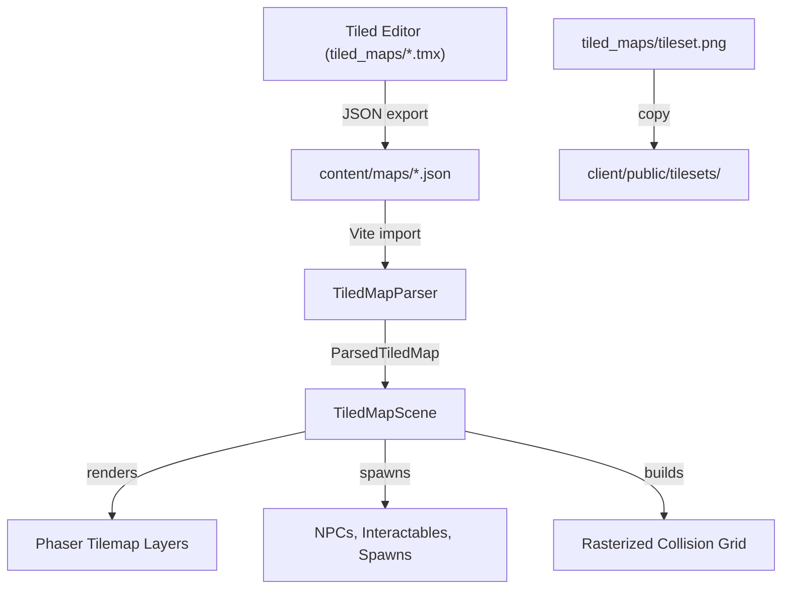

# Tiled Map Integration Plan

## Architecture Overview




## Phase 1: Foundation -- Tileset and New Parser

### 1a. Tileset as static asset

- Copy `tiled_maps/tileset.png` to `client/public/tilesets/tileset.png`
- Preload in boot scene: `this.load.image('tileset_main', 'tilesets/tileset.png')`

### 1b. New Tiled map parser ([client/src/game/map/TiledMapParser.ts](client/src/game/map/TiledMapParser.ts))

- Replace `TileMapManager.ts` with a new parser that handles the richer Tiled format
- Parse multiple tile layers by name: `ground`, `detail_down`, `detail_up`
- Parse `objects` layer: extract spawn points (named), interactables, NPCs, transitions
- Parse `collision` object layer: rasterize polygons/ellipses into a boolean grid
- Use snake_case property names (`destination_map`, `destination_spawn`, `object_id`, `npc_id`)
- Output a `ParsedTiledMap` type:

```typescript
interface ParsedTiledMap {
  width: number;          // tiles
  height: number;         // tiles
  tileWidth: number;      // px
  tileHeight: number;     // px
  groundData: number[];
  detailDownData: number[];
  detailUpData: number[];
  collisionGrid: boolean[][]; // true = walkable
  spawns: Map<string, { gridX: number; gridY: number }>;
  npcs: ParsedNpc[];
  interactables: ParsedInteractable[];
  transitions: ParsedTransition[];
  tilesetSource: string;  // e.g. "main"
  firstGid: number;
}
```

### 1c. Polygon-to-grid rasterizer ([client/src/game/map/collisionRasterizer.ts](client/src/game/map/collisionRasterizer.ts))

- Input: collision object layer (polygons, ellipses, rectangles) + grid dimensions
- Output: 2D boolean grid
- For each grid cell center, test if it falls inside any collision shape
- Polygon: point-in-polygon test (ray casting)
- Ellipse: standard ellipse containment check
- Rectangle: simple bounds check
- Default: cells not covered by any collision shape are walkable

## Phase 2: Generic TiledMapScene

### 2a. New scene class ([client/src/game/scenes/TiledMapScene.ts](client/src/game/scenes/TiledMapScene.ts))

- Single scene that replaces VillageScene, EldersHouseScene, etc.
- Scene data: `{ mapKey: string; spawnName?: string; spawnGridX?: number; spawnGridY?: number }`
- On create:
  1. Look up `ParsedTiledMap` from registry by `mapKey`
  2. Create Phaser tilemap from data arrays using `this.make.tilemap()` or manual image placement
  3. Render `ground` layer at depth 0
  4. Render `detail_down` layer at depth 1
  5. Place player sprite at named spawn point (or `spawnGridX/Y` fallback) at depth 2
  6. Render `detail_up` layer at depth 3
  7. Initialize `GridMovement` with the rasterized collision grid
  8. Spawn NPCs and interactables from parsed data
  9. Set up camera bounds and follow

### 2b. Data-driven transitions

- Remove hardcoded `doorTransitions` table from `InteractionHandler.ts`
- Instead, `ParsedTransition` objects carry `destination_map` and `destination_spawn`
- When player interacts with a transition object:
  1. Look up `destination_map` to get the target map key
  2. Start `TiledMapScene` with `{ mapKey: destination_map, spawnName: destination_spawn }`
- The scene resolves the spawn name to grid coordinates from its `spawns` map

### 2c. Named spawn point system

- Each map has a `Map<string, GridPosition>` of named spawns
- On scene start, resolve `spawnName` to coordinates: `spawns.get(data.spawnName)`
- Fallback: `spawnGridX/Y` if provided, then first spawn found, then (1,1)

## Phase 3: Content Pipeline

### 3a. Update content/maps/ with Tiled exports

- Export Tiled maps from `tiled_maps/*.tmx` to `content/maps/*.json`
- The existing `village.json` and `elders_house.json` in `content/maps/` will be replaced
- `tiled_maps/` remains the source-of-truth for editing; `content/maps/` is the consumable output

### 3b. Update shared types ([packages/shared/src/types/map.ts](packages/shared/src/types/map.ts))

- Extend `TiledMapData` to include:
  - `tilesets` array (with `firstgid` and `source`)
  - `orientation`, `renderorder` fields
- Extend `TiledLayer` to support polygon/ellipse objects in collision layers
- Extend `TiledObject` to include `polygon`, `ellipse` fields
- Update `MapObjectPlacement` to use snake_case (`object_id`, `npc_id`)
- Add `MapTransition` type with `destination_map`, `destination_spawn`

### 3c. Migrate existing property names to snake_case

- Update `content/npcs/*.json`, any references using `npcId` to `npc_id`
- Update `InteractableObject.ts`, `InteractionHandler.ts`, and entity code to read snake_case properties
- Update or add Zod validation schema for map files in shared package

## Phase 4: Cleanup and Validation

### 4a. Map content validation

- Add a Zod schema for the Tiled map format in `packages/shared/src/validators/map.schema.ts`
- Update `scripts/validate-content.ts` to validate map files:
  - All `destination_map` values reference existing map files
  - All `destination_spawn` values reference spawn names in the target map
  - All `object_id` values reference existing container/item definitions
  - All `npc_id` values reference existing NPC definitions

### 4b. Remove old system

- Remove `tileRenderer.ts` (procedural color rendering)
- Remove per-map scene subclasses (VillageScene, EldersHouseScene, etc.)
- Remove `TILE_COLORS` constant
- Update `BootScene.ts` to parse maps with new parser and start `TiledMapScene`

## Key Files Changed


| File                                            | Change                               |
| ----------------------------------------------- | ------------------------------------ |
| `packages/shared/src/types/map.ts`              | Extend types for full Tiled format   |
| `client/src/game/map/TiledMapParser.ts`         | New parser (replaces TileMapManager) |
| `client/src/game/map/collisionRasterizer.ts`    | New polygon-to-grid converter        |
| `client/src/game/scenes/TiledMapScene.ts`       | New generic scene                    |
| `client/src/game/scenes/BootScene.ts`           | Updated map loading                  |
| `client/src/game/systems/InteractionHandler.ts` | Data-driven transitions              |
| `client/public/tilesets/tileset.png`            | New static asset                     |
| `content/maps/*.json`                           | Replaced with Tiled exports          |


## Risks and Open Questions

- **Tileset PNG missing from repo**: `tiled_maps/tileset.png` needs to be committed or sourced. Verify the file exists locally.
- **Phaser 4 Tiled support**: Phaser 4 is newer; confirm `Phaser.Tilemaps` API is stable. May need to fall back to manual spritesheet rendering if the API has gaps.
- **Performance**: Large maps (36x20 = 720 tiles x 3 layers = 2160 tile images) should be fine, but test with Phaser's tilemap batching.
- **Tiled version lock**: Maps use Tiled 1.11.2 format (version 1.10). Pin this in project docs.
- **Property convention mismatch with `village_tower_exit**`: This object is missing `kind`. Define convention: any object with `destination_map` is a transition regardless of `kind`.

